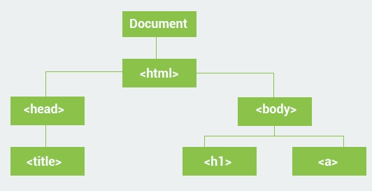

# The DOM

When you open any webpage in a browser, the HTML of the page is loaded and rendered visually on the screen. 
To accomplish that, the browser builds the Document Object Model of that page, which is an object oriented
model of its logical structure. The DOM of an HTML document can be represented as a nested set of boxes:

JavaScript can be used to manipulate the DOM of a page dynamically to add, delete and modify elements.

----

The DOM represents a document as a tree structure.
HTML elements become interrelated **nodes** in the tree.
All those nodes in the tree have some kind of relations among each other. 
Nodes can have **child** nodes. Nodes on the same tree level are called **siblings**.

For the example above:
- &lt;html&gt; has two children (&lt;head&gt;, &lt;body&gt;);
- &lt;head&gt; has one child (&lt;title&gt;) and one parent (&lt;html&gt;);
- &lt;title&gt; has one parent (&lt;head&gt;) and no children;
- &lt;body&gt; has two children (&lt;h1&gt; and &lt;a&gt;) and one parent (&lt;html&gt;);

There is a predefined **document object** in JavaScript, which can be used to access all elements on the DOM.
In other words, the document object is the owner (or **root**) of all objects in your webpage.

----

Each element in the DOM has a set of properties and methods that provide information about their relationships in the DOM:
- element.**childNodes** returns an array of an element's child nodes.
- element.**firstChild** returns the first child node of an element.
- element.**lastChild** returns the last child node of an element.
- element.**hasChildNodes** returns true if an element has any child nodes, otherwise false.
- element.**nextSibling** returns the next node at the same tree level.
- element.**previousSibling** returns the previous node at the same tree level.
- element.**parentNode** returns the parent node of an element.

